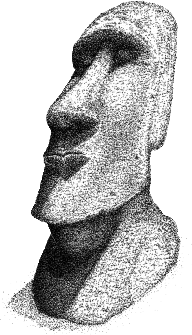

  

# Tuff

This sh script shortens the Pebble SDK commands used to clean, build and install a Pebble project.
It is to be used in a sh shell by Pebble developers who are working in the Pebble SDK environment, not on CloudPebble.

Its default action when `tuff` is run in a Pebble project directory is to build the project. It also supports cleaning `tuff -t`, and installing the project to your phone `tuff -i` or an emulator `tuff [-a, -b, or -c]`. It also supports chaining options together. To clean, build and install a Pebble project to your phone, you could either run `tuff -t -i` or `tuff -ti`.

I wrote this to learn how to program bash script, and speed up my Pebble development by typing less words. Ironically, I've probably typed more writing this script then I would have just using the standard Pebble SDK commands. There are other ways to accomplish what this script does, such as using an alias for each Pebble command in your .bash_profile, but then you wouldn't have Tuff's cool ANSCII art displaying whats going on in the build process.

## Install

###### This is not a replacement for the Pebble SDK. For this to work, you must already have the Pebble SDK installed on your computer. Installing Tuff will not modify or change the Pebble SDK.

In terminal, `cd` into the directory containing the `tuff` file.

Run the following line in terminal.

`cp tuff /usr/local/bin/`

This copies the file into your bin directory.

Run the following line in terminal.

`chmod u+x /usr/local/bin/tuff`

This allows you to have execute permissions for this script

Run the following line in terminal.

`echo "export PATH=/usr/local/:tuff$PATH" >>~/.bash_profile`

The line above adds the path to 'tuff' in your bash_profile.

If you haven't already added your pebble phone IP address to your .bash_profile, run the following line in terminal, replacing the '0's with your phones IP address.

`echo "export PEBBLE_PHONE=000.000.000.000" >>~/.bash_profile`

It is important to have this set if you would like to use this script to install to your phone.

Run the following line in terminal.

`source ~/.bash_profile`

This reloads your bash_profile settings in the current shell.

Now when you type `tuff` in terminal in the root directory of a pebble project, it will run this script.

## Terminal Commands
`tuff` Builds the pebble project

`tuff [-options]` Builds the pebble project + options

`tuff [-modifier]` Executes only the modifier

### Single Options
##### First Option
`-t` Cleans the project before the build stage
##### Second Option
`-i` Installs the project, default is phone

`-a` Installs the project to the aplite emulator

`-b` Installs the project to the basalt emulator

`-c` Installs the project to the chalk emulator

### Combining Options
`-ti` Cleans and installs the project to the default

`-ta` Cleans and installs the project to the aplite emulator

`-tb` Cleans and installs the project to the basalt emulator

`-tc` Cleans and installs the project to the chalk emulator

### Modifier Options
###### Modifier options can only be run alone
`-s` Takes a screenshot

`-h` Displays the help page

`-v` Displays the version

## Contributing
If you would like to add to this project, please fork it, create a single commit for the change that you have added, and create a pull request.

## License
This project uses the MIT License.
